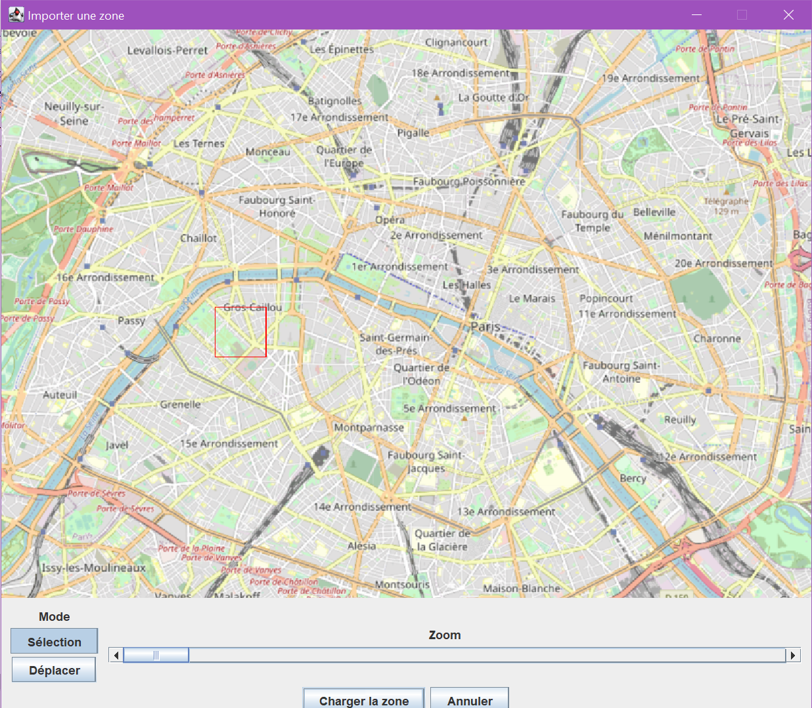
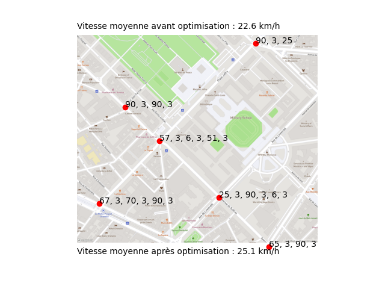

# SimTraffic

Ce projet a été réalisé en 2020-2021 par Lysiane Burel, Zineb Bouharra, Reuven Windisch, Louis Petitjean, Clément Teytaud, Dorian Gailhard, Mattéo Ratet et Ryuto Yokoyama.

<h3>Logiciel de simulation et d'optimisation de traffic.</h3>
  

L'encombrement du réseau routier est responsable de perte de temps pour les usagers et de pollution atmosphérique et sonore. Pour cela, nous souhaitons mettre le numérique au service de l'humain et de son environnement en créant un logiciel de gestion, à destination des services d'urbanisme des collectivités territoriales qui puisse simuler le traffic avec plusieurs combinaisons de signalisation et qui propose ensuite une solution pour réduire les embouteillages.

Ce logiciel a pour but de déterminer la meilleure durée de phase des feux tricolores dans une zone géographique donnée, en tenant compte du traffic routier réel. Il s'appuie sur le ligiciel open source SUMO de simulation du trafic. Il est téléchargable via ce lien : https://www.eclipse.org/sumo/. Il faut avoir téléchargé ce logiciel pour pouvoir utiliser SimTraffic.

<h4>Comment utiliser le logiciel ?</h4>
<ol>
<li>Téléchargez les dossiers src et data</li>
<li>Exécutez Main.java</li>
<li>Une fois lancé, allez dans le menu "Edition", puis sélectionnez "Chargez depuis OpenStreetMap"</li>
<li>Sélectionnez une zone à étudier</li>
  
<li>Cliquez sur "Chargez la zone"</li>
<li>Laissez tourner quelques dizaines de secondes</li>
<li>Observez le résultat. Les points rouges représentent les feux tricolores, et les différentes phases sont écrites à côté.</li>
  
</ol>

